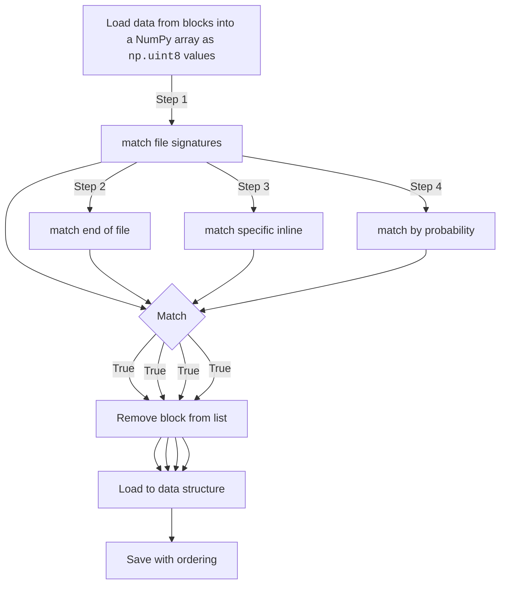
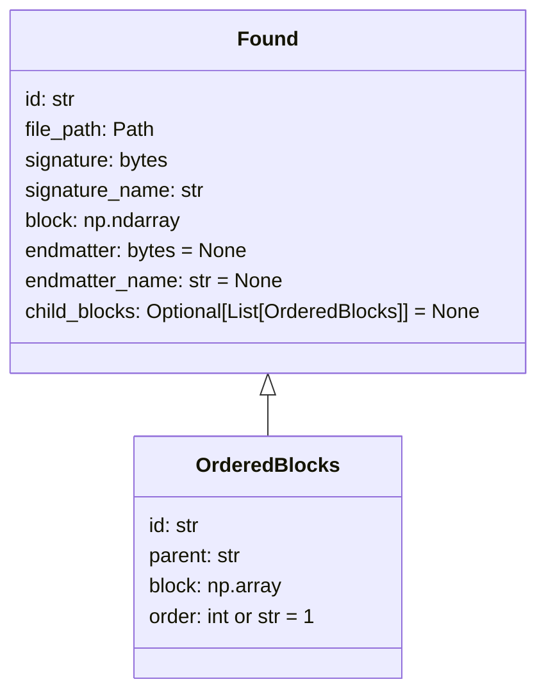

# File System Analysis Toolkit for File Recovery

> When analyzing the imaged copies, we often encounter some scenarios that we have a number of imaged blocks (disk sectors), but the indexing block (e.g., UNIX inode) has been eliminated/destroyed, assuming that there is no pointer information in these imaged blocks. The question is how to design and develop a toolkit to help to recover these files by first classifying the blocks into a number of sets according to file signatures. And then for each set of blocks, the toolkit should find the correct sequence of these sectors and reconstruct the file (possibly a part of the file). The file format supported by this toolkit can be MS WORD, PDF, JPEG, TIF, TXT, etc.  You can use Encase or other tools to create your own data set, or use the set of imaged disk sectors we provide. The toolkit can be run on Linux or Windows systems.
>
> The imaged disk sectors file [CP3-3-blockset.zip](https://www.engineering.iastate.edu/~guan/course/CprE-536/courseproject920/CP3-3-blockset.zip) we provide here contains 899 randomly indexed blocks, each of which has size 512 bytes. These blocks belong to three different files: 
> * one PDF
> * one WORD
> * one JPEG 
> 
> _There is no unallocated block._
>
> Please develop a toolkit which can classify these blocks into three sets correctly. Furthermore, if you can find the correct sequence of these blocks and reconstruct the files, you can get 3 bonus points.

* Filename = [CP3-3-blockset.zip](https://www.engineering.iastate.edu/~guan/course/CprE-536/courseproject920/CP3-3-blockset.zip)
* MD5 sum = 017c90727e8dfcb757ae189cacc74c18


## Characteristics of the blocks

Each block is 512 bytes. Typically the blocks are full of data, but in the case where a file ends within a block sector the remaineder is filled with `00` hexidecimal values. This is an important feature since it guarantees that all file signatures will be found at the beginning of the file. When searching for file signatures, I had to rely on this facet as the PDF document (I suspect) contained JPEG images, resulting in several matches for the same hexadecimal set.

## Detecting Documents

I performed research for each of the above expected files, Microsoft Word document (`doc`, Word 1997-2004 specification), PDF, and JPEG (JFIF 3.0 standard). I was able to determine the correct versions by referencing the file signatures listing [^1] on Wikipedia. The appropriate hexidecimal codes for each are as follows:

```plain
DOC:  \xD0\xCF\x11\xE0\xA1\xB1\x1A\xE1
PDF:  \x25\x50\x44\x46\x2D
JPEG: \xFF\xD8\xFF\xE0\x00\x10\x4A\x46
```

Each of these are programmed manually in the [signatures.py](./conversions/signatures.py) dictionary. This identification process became the first step in my process to enumerate the blocks. I started with a broader list of signatures and then pared down based on the matching results.

Example of matching signature from JPEG design standards[^3]:

```plain
FFD8		JPEG - start of image
FFE0		JFIF-APP0

0010		Length (excludes APP0 marker)
4A46494600	Identifier, JFIF (in ASCII), with a null byte

0101		Version (1.01)
00		Density - see x & y for data
0001		X Density
0001		Y Density
0000		Thumbnail x & y

--- start data
```

Before I did any additional block to file type allocation based on estimation, I defined another set of **end of file** and other **inline** matches.

### End of file

These are hexadecimal patterns common to the end of a file. These are either found at the very end of a file (resulting in the hexadecimal pattern followed by empty values until the end of the sector) or near enough to be contained _within_ the same block as the actual end of the file. These are specified in [end_of_file.py](conversions/end_of_file.py)

| File signature | Hex pattern | Description |
| --- | --- | --- |
| DOC | `\x44\x6F\x63\x75\x6D\x65\x6E\x74` | "Document" -- a phrase commonly embedded at/near the end of Microsoft Word Documents.|
| PDF | `\x25\x25\x45\x4F\x46\x0D\x0A\x00` | "%%EOF" it will additionally match empty space to avoid mis-match of blocks within the same PDF file. |
| JPEG | `\xFF\xD9\x00\x00` | Standard end of file, [^3] |

### Inline

There are certain patterns that only match certain file types (at least beween the three selected options here). These are ordered randomly or in a non-specific way within the file. Isolating these types of matches will make my end result more accurate. These are specified in [inline.py](./searches/inline.py). The research for each was from analyzing sample documents, JPEG resources [^3],[^4], and PDF resources [^5]

| File signature | Hex pattern | Description |
| --- | --- | --- |
| DOC | `\x2E\x78\x6D\x6C` | `[Content_Types].xml` – used for theming. Appears early. |
| PDF | `\x2F\x50\x61\x67` | Matches `/Pag`[e][s] (shortened to be even length) |
| PDF | `\x2F\x52\x6F\x6F` | Matches `/Roo`[t] ((shortened to be even length)) |
| PDF | `\x30\x30\x30\x30\x20\x6E` | Matches [0]`0000 n` (shortened to be even length) |
| PDF | `\x78\x72\x65\x66` | Matches `xref` |
| PDF | `\x3E\x3E\x20\x2F` | Matches `>> /` – common formatters in PDF |
| PDF | `\x65\x6E\x64\x73\x74\x72\x65\x61` | Matches `endstrea`[m] (shortened to be even length) |
| PDF | `\x2F\x50\x72\x6F\x64\x75\x63\x65` | Matches `/Produce`[r] (shortened to be even length) |
| PDF | `\x20\x36\x35\x35\x33\x35\x20\x66` | This matches against what's already in the trailer -- always at the end. |
| JPEG | `\xFF\xD9` | This denotes the end of a thumbnail. It should only find valid results since it's being found after the standard endmatter. |

Once I had these confirmed I began a process to generate samples of each type of file type.

## Generating Samples

Samples will be used for baseline statistical analysis. The goal of this analysis is to have a typical character set range for each of the document types. With this numerical range established blocks can be sequentially allocated to the correct _parent_ (file signature). When this parent block is combined with all of it's children a full document is created.

You can find the samples in [samples](./samples).

### JPEG Sample

This is a simple an image pulled from _Lorem Picsum_[^2], an image placeholder provider.

### DOC Sample

I generated a document using Microsoft Word. After some preliminary analyzation of the blocks, I knew that the character set of a `doc` file is stored in plaintext. This means that hexidecimal analyzation will be possible by limited results to a narrow spectrum of characters (commonly, the Latin alphabet). In order to get a proper statistical analysis it was important to collude this data with images, citations, and tables -- all including characters that would affect the analysis. This file was saved using the Microsoft Word compatibility 1997-2004 format (identical to the format found in the file signature data).

### PDF Sample

This was generated by re-encoding the Word document using Microsoft's built in tooling to a PDF. All of the advantages of the Word document design applies to PDF analyzation.

## Managing Data and Building a Toolset

**Python modules utilized:**
* NumPy [^6]
* Dataclasses [^7]
* Jupyter [^8]

I used the following process to read the data:



The data processing order is important as for each `TRUE` match the block will be removed from the list of potential future matches. For all steps after the first match (file signatures) they are organized under the file signature name. This means each unassigned block will be iterated, checked for match patterns, assigned if true, and the data object for that file signature type will be updated.

Here is an example of the NumPy array:

```python
$ data = np.fromfile(open('blockset/BLOCK0009','rb'),dtype=np.uint8)
$ print(data)
[111 118 101 114  32 116 104 114 101  97 100 115  44  32 105 110  32 116
 104 105 115  32 112  97 112 101 114  32 119 101  32 114 101 112 111 114
 116  32 111 110 108 121  32 116 104 101  32  73  80  67  32 102 111 114
  32 101  97  99 104  13 101 120 112 101 114 105 109 101 110 116  46  13
  51  46  32  83  80  69  67  85  76  65  84  73  79  78  32  79  78  32
  83  77  84  13  84 104 105 115  32 115 101  99 116 105 111 110  32 112
 114 101 115 101 110 116 115  32 116 104 101  32 114 101 115 117 108 116
 115  32 111 102  32 111 117 114  32 115 105 109 117 108  97 116 105 111
 110  32 101 120 112 101 114 105 109 101 110 116 115  32 111 110  32 105
 110 115 116 114 117  99 116 105 111 110  13 115 112 101  99 117 108  97
 116 105 111 110  32 102 111 114  32  83  77  84  46  32  79 117 114  32
 103 111  97 108  32 105 115  32 116 111  32 117 110 100 101 114 115 116
  97 110 100  32 116 104 101  32 116 114  97 100 101  45 111 102 102 115
  32  98 101 116 119 101 101 110  32 116 119 111  32  97 108 116 101 114
 110  97 116 105 118 101  13 109 101  97 110 115  32 111 102  32 104 105
 100 105 110 103  32  98 114  97 110  99 104  32 100 101 108  97 121 115
  58  32 105 110 115 116 114 117  99 116 105 111 110  32 115 112 101  99
 117 108  97 116 105 111 110  32  97 110 100  32  83  77  84 146 115  13
  97  98 105 108 105 116 121  32 116 111  32 101 120 101  99 117 116 101
  32 105 110 115 116 114 117  99 116 105 111 110 115  32 102 114 111 109
  32 109 117 108 116 105 112 108 101  32 116 104 114 101  97 100 115  32
 101  97  99 104  32  99 121  99 108 101  46  32  70 105 114 115 116  44
  32 119 101  32  99 111 109 112  97 114 101  13 116 104 101  32 112 101
 114 102 111 114 109  97 110  99 101  32 111 102  32  97 110  32  83  77
  84  32 112 114 111  99 101 115 115 111 114  32 119 105 116 104  32  97
 110 100  32 119 105 116 104 111 117 116  32 115 112 101  99 117 108  97
 116 105 111 110  32  97 110 100  13  97 110  97 108 121 122 101  32 116
 104 101  32 100 105 102 102 101 114 101 110  99 101 115  32  98 101 116
 119 101 101 110  32 116 104 101]
```

### Data structure

To accurate maintain the information needed about a block I relied on `dataclasses` to define strutured arrays.



As blocks are iterated over specific parameters for each match determines order. For example, the inline matches will have an order integer assigned to each match. As the final array is assembled each block is placed into the array at the specified order. This allows for dynamic ordering during processing and repeated order associations – e.g., a block that matches for order `200` will be inserted into that number at an array effectively sliding the existing index at the point to the right (to `201`).

### Probabilty-based identification

Once the header, end of file, and common inline matches are met, there is still a bulk of unidentified block data. This data can vary significantly (at least between the three selected document types). I utilized the [sample documents](#generating-samples) to establish probability of character occurences in documents.

> [!NOTE]
> This is unpolished.

The intial process loaded in [statistic.ipynb](./statistics.ipynb) and implemented in the code using the [character_types.py](./searches/character_types.py) tooling. This code allows a simple rule to be created that matches the numpy array `uint8` values (`0-255`) that align with ASCII characters. The rule will be defined with the following parameters:

* `start`
* `end`
* `match_percent` – The selected values from the block of interest must be `>=` than this number.

I only implemented a cursory approach to this. The common Latin alphabet occurs within 65-122 (Aa-Zz) so I applied a rule for this to the Word document for a match of 30%. The rules cascade since blocks that match are removed from the available match set – so I utilze the same alphabet rule to match PDF files just at a lower precentage (10%). Any unmatched blocks are saved as JPEG.

## Improvements

There's a lot of room for improvement (since I can't open the files yet).

### Probability Matching

The majority comes with the probability matching. I think I should subdivide the blocks into smaller "words" and scan those. My calculations for probabilities can be automated from the sample documents by breaking those down to smaller segents and generating the `CharacterTypesRule` via code. I believe my method of data handling is very efficient for pattern detecting (NumPy and Pandas).

### Ordering

I don't have a good solution to determining block order. I think the JPEG option could involve rotating and testing using a common JPEG validity library [^9]. 

The Word document might be well suited to hand placement using a prompting style, but that could be quite time consuming. This is similar to the PDF in the sense that detecting a valid combiniation of segments is challenging. It might be possible to create a valid document with an empty middle, that matches the length of identified segments from the random block data. From this working document blocks could be swapped in and out one at a time. A valid entry would ensure that even in the case of out-of-order text, the functionailty of the document is not affected.


[^1]: https://en.wikipedia.org/wiki/List_of_file_signatures
[^2]: https://picsum.photos
[^3]: https://en.wikipedia.org/wiki/JPEG_File_Interchange_Format
[^4]: https://www.w3.org/Graphics/JPEG/jfif3.pdf
[^5]: https://www.oreilly.com/library/view/developing-with-pdf/9781449327903/ch01.html#example_1-12
[^6]: https://numpy.org
[^7]: https://docs.python.org/3/library/dataclasses.html
[^8]: https://jupyter.org
[^9]: https://www.kokkonen.net/tjko/src/man/jpeginfo.txt